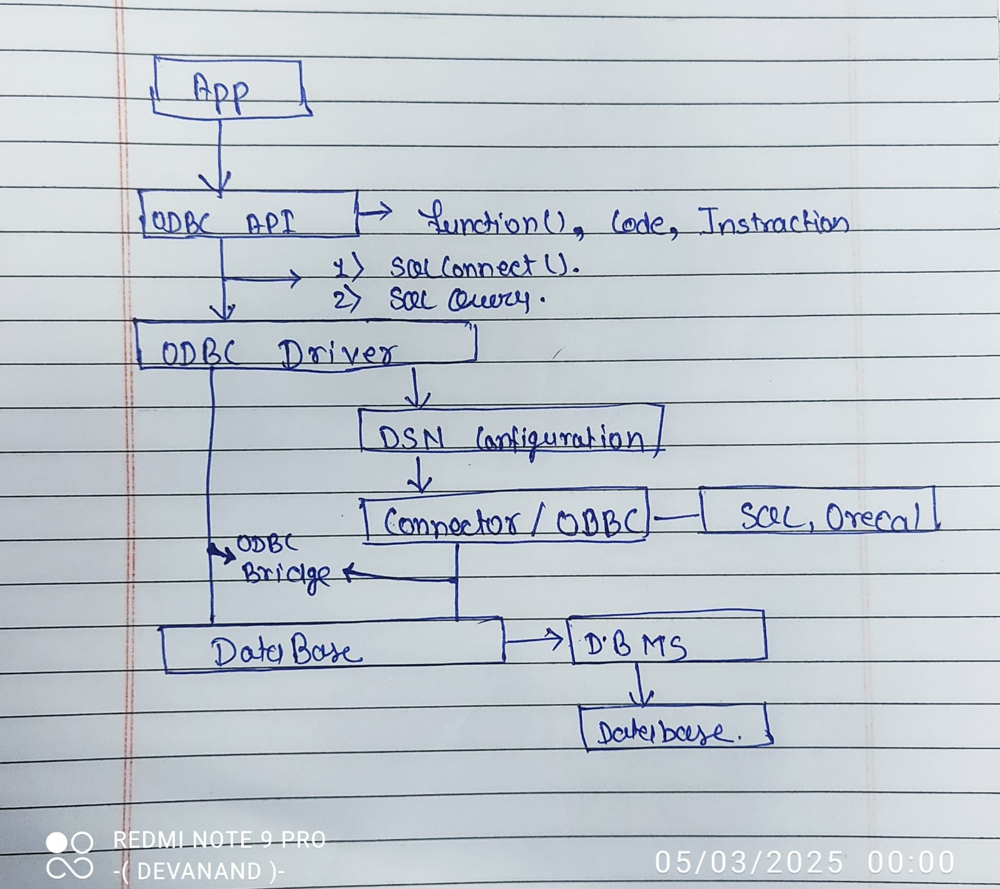

# Open Database Connectivity (ODBC) - README

## What is ODBC?
ODBC stands for **Open Database Connectivity**. It is a standard **Application Programming Interface (API)** introduced by **Microsoft in 1992** to enable applications to connect to different databases using a common interface. ODBC operates on a **driver-based architecture** and is mainly **procedural**, making it suitable for the **Windows platform**.

### Key Features of ODBC:
- Works on **driver-based architecture**.
- Supports **multiple programming languages** like **C, C++, Java, Python, etc.**
- Provides a **common interface** for interacting with different DBMS.
- Uses **Data Source Name (DSN)** to identify database connections.

---

 

## How ODBC Works (Simplified)
1. The **application calls the ODBC API**.
2. The **ODBC Driver Manager** processes the request.
3. The **specific ODBC driver** translates the request into a format the DBMS understands.
4. The **DBMS executes the query** and returns the result via the ODBC driver.

---

## Explanation of ODBC API Components

### 1. **Application Uses ODBC API**
- The application calls ODBC API functions to send SQL queries or request database operations.
- Example API function:
  - `SQLConnect()` – Connects to the database.

### 2. **ODBC Driver Translates & Communicates with DBMS**
- Each database has a specific **ODBC driver** (e.g., MySQL ODBC Driver, SQL Server ODBC Driver).
- The ODBC driver translates ODBC API function calls into the **native database commands**.
- It sends the SQL query to the DBMS for execution.

### 3. **ODBC Driver Manager Processes the Request**
- The **ODBC Driver Manager** receives the request from the application.
- It determines the correct **ODBC driver** based on the **DSN (Data Source Name)**.
- It loads the appropriate driver and forwards the request.

---

## Flow Between ODBC and Database
1. **Install the ODBC Driver** for your database (e.g., MySQL ODBC Driver, SQL Server ODBC Driver).
2. **Configure the ODBC Data Source (DSN) in Windows**:
   - Open **ODBC Data Source Administrator** (`odbcad32.exe`).
   - Add a new **System DSN**.
   - Select the driver (**MySQL, SQL Server, etc.**).
   - Configure the database connection.
3. **Use Java to Connect via JDBC-ODBC Bridge**.

---

## Conclusion
ODBC provides a standardized way for applications to communicate with different databases without needing to write database-specific code. It simplifies database connectivity and ensures interoperability across various systems.

