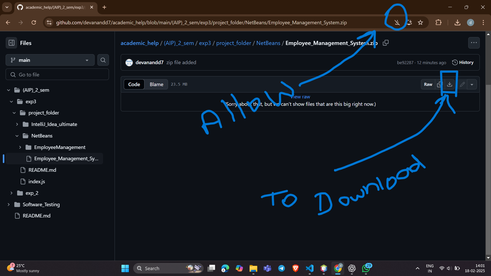

Here’s a sample README file you can use:

---

# Employee Database Setup

## Requirements

Before you begin, ensure you have the following installed:

1. **MySQL Workbench**  
   [Download MySQL Workbench](https://dev.mysql.com/downloads/workbench/)

2. **NetBeans / IntelliJ IDEA Ultimate**
   - [Download NetBeans](https://netbeans.apache.org/download/index.html)
   - [Download IntelliJ IDEA Ultimate](https://www.jetbrains.com/idea/download/) // If you are a student, activate your account using your university/college official email. Otherwise, you can opt for a 30-day trial.


---

## Step 1: Create a Database

Once MySQL Workbench is installed and running, follow these steps:

### SQL Code to Create the Database and Table

```sql
-- Create database
CREATE DATABASE DBemployee;

-- Use the created database
USE DBemployee;

-- Create employees table
CREATE TABLE employees (
    id INT AUTO_INCREMENT PRIMARY KEY,
    name VARCHAR(255),
    department VARCHAR(255),
    salary DOUBLE
);

-- Inserting data into the employees table
INSERT INTO employees (name, department, salary) VALUES
('David ', 'Engineering', 80000),
('dev ', 'Marketing', 65000),
('Emily Johnson', 'Sales', 70000);


-- For deleting data from the database
DELETE FROM employees WHERE id = 9;

-- Display all employees
SELECT * FROM employees;

-- Show available databases
SHOW DATABASES;
```

- **Important:** Remember the password you set during MySQL installation.

---

## Step 2: Download Required Files

Download the zip files provided by me:

1. **NetBeans** – ['./project_folder/NetBeans/EmployeeManagement'](https://github.com/devanandd7/academic_help/blob/main/(AIP)_2_sem/exp3/project_folder/NetBeans/Employee_Management_System.zip)
2. **IntelliJ IDEA** – ['./project_folder/IntelliJ_Idea_ultimate/Employee_Management_System'](./project_folder/IntelliJ_Idea_ultimate/Employee_Management_System.zip)

---
Allow to download .


## Step 3: Extract and Paste the Files

### For NetBeans:

1. Unzip the downloaded file.
2. Copy the extracted folder.
3. Paste it in the following directory:
   ```
   C:/Documents/NetBeans_Project/...
   ```

### For IntelliJ IDEA:

1. Unzip the downloaded file.
2. Copy the extracted folder.
3. Paste it in the following directory:
   ```
   C:/Users/[Your_Folder_Name]/IdeaProject/...
   ```
.png)

## Make some change in file 
   **Hibernet.cfg.xml**
     * Replace the pass with your MySQL password.

If you're unable to find the project directory, you can open the IDE, create a new project, hover over the project, and copy the path. Then paste the extracted files into that path.


see mouse hover -


---

## Step 4: Open Your IDE

After pasting the files, open your IDE:

- **NetBeans / IntelliJ IDEA:**  
   Launch the IDE and make sure the project is recognized.

---

## Step 5: Set Permissions (For IntelliJ IDEA)

If you're using IntelliJ IDEA, some pop-up windows may appear asking for permission. Allow all permissions, as this will allow the IDE to download necessary files and dependencies in the background.

---

## Step 6: Watch Setup Video

For step-by-step instructions on how to configure your environment and run the code, please watch the following video:  
[Video Uploaded Soon]

---

## Step 7: All Done!

Once you have completed these steps, your setup will be ready. You can now start working on the project.

Click on the image to play the video.

---
[](https://www.youtube.com/watch?v=PikDAVc90XI)
<!-- ## Setup & Installation Guide -->


Let me know if you need any further modifications or additional instructions! message me on grthib.
