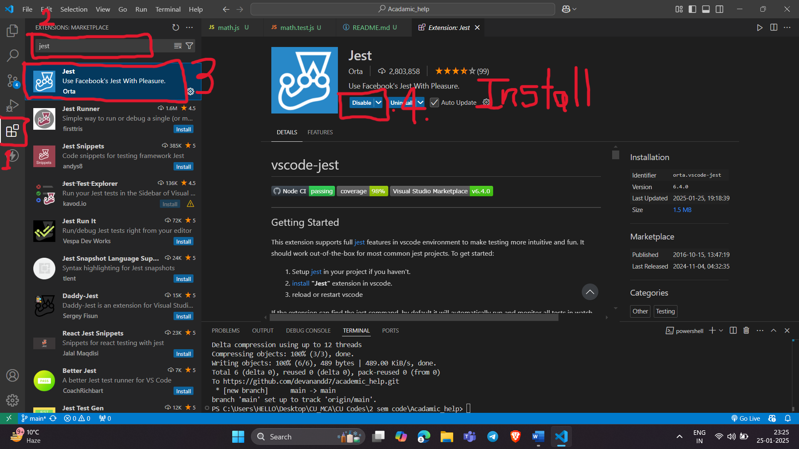
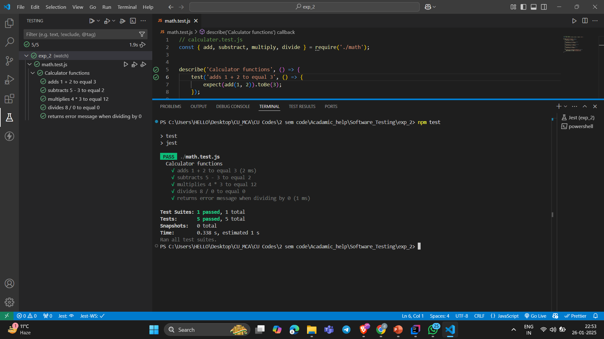

# Testing in VS Code Using Jest

This guide explains how to set up Jest for testing in Visual Studio Code (VS Code), including installation, configuration, and running tests.

## 1. Prerequisites
Ensure you have the following installed:
- [Node.js](https://nodejs.org/) (LTS version recommended)
- VS Code

## 2. Install Jest
You can install Jest globally or as a development dependency in your project.

### Global Installation (optional)
```sh
npm install -g jest
```

### Project Installation
Navigate to your project folder and install Jest:
```sh
npm init -y  # Initialize a package.json if not created
npm install --save-dev jest
```

## 3. Install VS Code Jest Extension
To enhance the Jest experience in VS Code:
1. Open VS Code.
2. Go to the **Extensions** panel (`Ctrl + Shift + X` or `Cmd + Shift + X` on macOS).
3. Search for **Jest** and install it (Official Jest extension by Orta).




## 4. Project Folder Structure
Ensure your project is structured as follows:
```
project-folder/
│── node_modules/
│
│── math.js
│
│── math.test.js
│── package.json
│
```

### 5.Using NPM Script
Add the following script to your `package.json`:
```json
"scripts": {
  "test": "jest"
}
```



## 6. Writing Tests
### Example Code: `math.js`
```js
function add(a, b) {
  return a + b;
}

function subtract(a, b) {
  return a - b;
}

module.exports = { add, subtract };
```

### Example Test File: `tests/math.test.js`
```js
const { add, subtract } = require('../src/math');

test('adds 2 + 3 to equal 5', () => {
  expect(add(2, 3)).toBe(5);
});

test('subtracts 5 - 2 to equal 3', () => {
  expect(subtract(5, 2)).toBe(3);
});
```

## 7. Running Tests
You can run Jest tests in multiple ways.

### Using NPM Script
Add the following script to your `package.json`:
```json
"scripts": {
  "test": "jest"
}
```
Then run:
```sh
npm test
```


## 8. Conclusion
You have now set up Jest for testing in VS Code, written test cases, and run them successfully. 🎉

